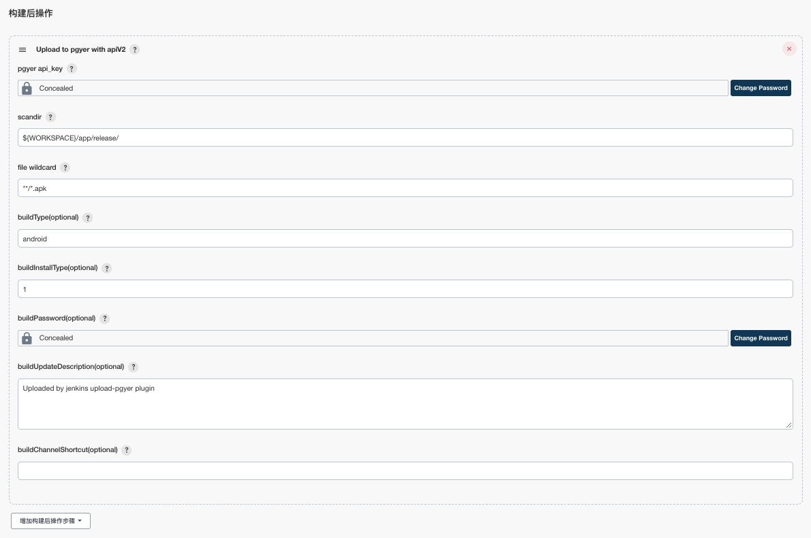

### A simple introduction

[中文文档](./README_cn.md)

[蒲公英官网文档](https://www.pgyer.com/doc/view/jenkins_plugin)

Pgyer can upload the application to the site, generate installation link and qr code user to open the installation link, or scan code qr code, can start installation.

### Install plugin

- Recommend

    `Manage Jenkins`  ->  `Manage Plugins`  ->  `Available`  ->  `Search `  -> *enter* `Upload to pgyer`  -> `install`

- Alternate

    1. Click [here](https://updates.jenkins-ci.org/latest/upload-pgyer.hpi) to download the latest version

    2. `Manage Jenkins`  ->  `Manage Plugins`  ->  `Advanced`  ->  `Upload Plugin`  ->  `Choose file`  ->  *choose* `upload-pgyer.hpi`  ->  `Upload`

### Build parameters

In version 1.34, two build parameters were added, namely `isUploadPgyer` and `uploadPgyerTimeout`.

1. `isUploadPgyer` Used to control whether to upload the apk/ipa file to payer.

    

2. `uploadPgyerTimeout` Used to control the upload timeout, the unit is seconds, the default is 300 seconds.

    

### User's guidance
So this plugin can be uploaded to the pgyer platform！**And it can put the fields returned by pgyer into an environment variable, which you can use in other build steps**, You can select `upload to pgyer` by adding build steps or adding post-build steps.

> Recommend **`upload to pgyer with apiV2`** , apiV1 may fail to upload.

### Introduction to parameters
field|explanation
----:|:----------
pgyer uKey|`(APIV1 Required, APIV2 NO)` User Key, used to identify the current user's identity,  for the same pgyer registered users, the value of the fixed! [Click to get pgyer uKey](https://www.pgyer.com/account/api)
pgyer api_key|`(Required)` API Key, used to identify the identity of the API caller,  if not specified, each interface needs to contain this parameter. For the same pgyer registered users, this value is fixed. [Click to get pgyer api_key](https://www.pgyer.com/account/api)
scandir|`(Required)` Need to upload ipa or apk file base dir path!   The default is ${WORKSPACE}, It means the path of the current project! It is using ant's DirectoryScanner class, [click to see DirectoryScanner class](https://ant.apache.org/manual/api/org/apache/tools/ant/DirectoryScanner.html) **It is equivalent to the parameters of the basedir method in the DirectoryScanner class!** [click to see basedir method](https://ant.apache.org/manual/api/org/apache/tools/ant/DirectoryScanner.html#basedir)
file wildcard|`(Required)` Need to upload ipa or apk file name, Support wildcards, like this: \*\*/\*.apk like this: \*\*/Test?/\*_sign.apk It is using ant's DirectoryScanner class, [click to see DirectoryScanner class](https://ant.apache.org/manual/api/org/apache/tools/ant/DirectoryScanner.html)  **It is equivalent to the parameters of the includes method in the DirectoryScanner class!** [click to see includes method](https://ant.apache.org/manual/api/org/apache/tools/ant/DirectoryScanner.html#includes)
installType|`(Optional)` Application installation, the value is (1,2,3). 1: public,  2: password installed,  3: invitation to install. The default is 1 public!
password|(Optional) Set the App installation password, if you do not want to set the password, please pass empty string, or not pass.
updateDescription|`(Optional)` Version update description, please pass empty string, or not pass.
channelShortcut|`(Optional)` The download short link of the specified channel that needs to be updated, only one channel can be specified, string type, such as: abcd.
qrcodePath|`(Optional)` If you need to download the qrcode, please enter the save path of the qrcode!otherwise, not download!
envVarsPath|`(Optional)` if you need to save info, please enter save file path! otherwise, not save!

### Running log

When it runs successfully, you can use the environment variables that are used! for example:

### Change Log

Version 1.34(2020-08-15)

- **Minimum Jenkins requirement: [2.164.1](http://mirrors.jenkins.io/war-stable/2.164.1)**
- Add `isUploadPgyer` build parameter
- Add `uploadPgyerTimeout` build parameter
- Upgrade pgyer api, add `channelShortcut` parameter
- Change the default value of `installType` to 1
- Optimize parameters verification
- Upgrade Gson 2.8.6
- Upgrade Ant 1.10.8
- Upgrade OkHttp3 3.14.9
- Optimize code to improve stability

Version 1.33(2019-09-07)

- Fixed [SECURITY-1044](https://issues.jenkins-ci.org/browse/SECURITY-1044)
- Upgrade gson 2.8.5

Version 1.31(2018-05-07)

- Upgrade gson 2.8.4
- Optimize upload log
- Change the document image address.

Version 1.30(2018-04-16）

- Remove jsoup, and import okhttp that be used network
- Add upload file progress
- Add [pgyer api v2](https://www.pgyer.com/doc/view/api#uploadApp)