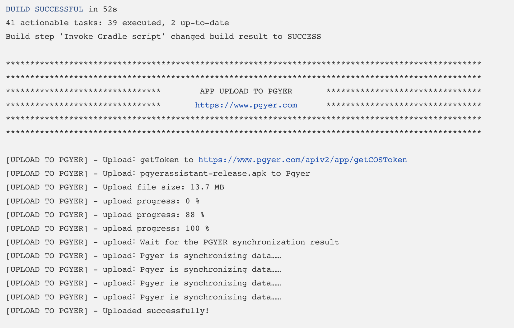
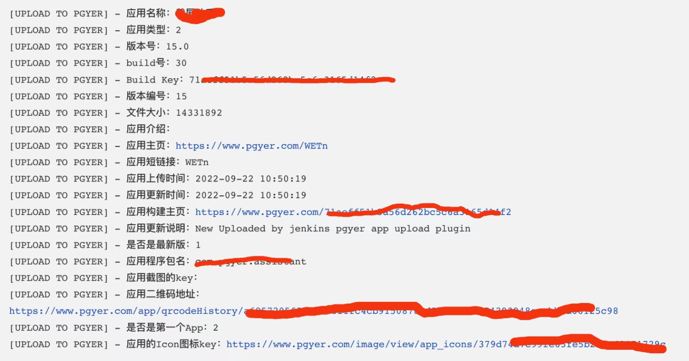

### 简单介绍

[蒲公英官网文档](https://www.pgyer.com/doc/view/jenkins_plugin)

蒲公英平台可以让开发者和企业将应用上传到网站，生成安装链接和二维码用户在手机上打开安装链接，或扫码二维码，即可开始安装！

因此，这款upload-pgyer的Jenkins插件可以让开发者将apk/ipa文件上传到蒲公英平台！**并且这款插件可以将蒲公英平台返回的应用信息解析后注入到Jenkins的全局变量中，这样你就可以很方便的在其他构建步骤中使用这些返回的信息**。

### 安装插件

- 推荐的安装方式

    `Manage Jenkins`  ->  `Manage Plugins`  ->  `Available`  ->  `Search`  -> *输入* `Upload to pgyer`  -> `install`

- 备用的安装方式

    1. 点击 [这里](https://updates.jenkins-ci.org/latest/upload-pgyer.hpi) 下载最新的版本

    2. `Manage Jenkins`  ->  `Manage Plugins`  ->  `Advanced`  ->  `Upload Plugin`  ->  `Choose file`  ->  *选择刚才下载的* `upload-pgyer.hpi`  ->  `Upload`

### 构建参数

在2.1版本中删除了两个构建参数，分别是`isUploadPgyer`和`uploadPgyerTimeout`，将构建参数`buildName`更改为`buildType`并且`buildType`为必填项

### 使用指南

你可以在Jenkins的job配置页面的`构建`和`构建后操作`这两个操作中点击添加构建步骤选择`upload to pgyer with apiV2`。然后你就可以看到类似下面图片的操作界面：

### 参数介绍

需要填写的字段|字段的解释
----:|:----------
pgyer api_key|(必填) API Key，用来识别API调用者的身份， 如不特别说明，每个接口中都需要含有此参数。 对于同一个蒲公英的注册用户来说，这个值在固定的。 [点击获取_api_key](https://www.pgyer.com/account/api)
scandir|`(必填)` 需要上传的apk/ipa文件所在的文件夹或者父文件夹， 当前默认路径是`${WORKSPACE}`，它代表了当前项目的绝对路径。 这个功能的实现使用了ant框架的DirectoryScanner类，[点击查看DirectoryScanner类](https://ant.apache.org/manual/api/org/apache/tools/ant/DirectoryScanner.html)， 这个字段就是DirectoryScanner类中的basedir方法的参数[点击查看basedir方法](https://ant.apache.org/manual/api/org/apache/tools/ant/DirectoryScanner.html#basedir)
file wildcard|`(必填)` 需要上传的apk/ipa文件的名字，支持通配符， 就像这样: \*\*/\*.apk 或者像这样： \*\*/Test?/\*_sign.apk， 这个功能的实现使用了ant框架的DirectoryScanner类，[点击查看DirectoryScanner类](https://ant.apache.org/manual/api/org/apache/tools/ant/DirectoryScanner.html)， 这个字段就是DirectoryScanner类中的includes方法的参数，[点击查看includes方法](https://ant.apache.org/manual/api/org/apache/tools/ant/DirectoryScanner.html#includes)
buildType|`(必填)` 需要上传应用程序类型，支持, 如: android 如: ios 默认值是: android
installType|`(选填)` 应用安装方式，值为(1,2,3)。 1：公开，2：密码安装，3：邀请安装。 默认为1公开
password|`(选填)` 设置App安装密码，如果不想设置密码，请传空字符串，或不传。
updateDescription|`(选填)` 版本更新描述，请传空字符串，或不传。
channelShortcut|`(选填)` 所需更新的指定渠道的下载短链接，只可指定一个渠道，字符串型，如：abcd

### 运行截图

当你的应用上传成功后，在Jenkins中你就能看到上面图片中的信息。同时，你就可以在其他构建步骤中使用蒲公英返回来的信息，例如我的经验：

### Change Log

版本 2.1(2022-10-26)

- **最低兼容Jenkins: [2.277.1](http://mirrors.jenkins.io/war-stable/2.277.1)**
- 移除apiv1的相关配置
- 删除' isUploadPgyer '构建参数
- 删除' uploadPgyerTimeout '构建参数
- 删除' buildName '构建参数
- 添加' buildType '构建参数(必填项)
- api变化
- 升级Gson 2.9.0
- 升级OkHttp3 4.10.0
- 优化代码以提高稳定性

版本 1.34(2020-08-15)

- **最低兼容Jenkins: [2.164.1](http://mirrors.jenkins.io/war-stable/2.164.1)**
- 添加 `isUploadPgyer` 构建参数
- 添加 `uploadPgyerTimeout` 构建参数
- 升级蒲公英API，添加 `channelShortcut` 参数
- `installType` 默认值设置为1
- 优化参数校验
- 升级Gson 2.8.6
- 升级Ant 1.10.8
- 升级OkHttp3 3.14.9
- 优化代码，提升稳定性

版本 1.33(2019-09-07)

- 修复[SECURITY-1044](https://issues.jenkins-ci.org/browse/SECURITY-1044)
- 升级Gson 2.8.5

版本 1.31(2018-05-07)

- 升级Gson 2.8.4
- 优化上传日志
- 更换readme.md图片地址

版本 1.30(2018-04-16）

- 移除Jsoup，并引入okhttp作为网络库
- 增加文件上传进度
- 增加蒲公英[APIV2](https://www.xcxwo.com/doc/view/api#uploadApp)
